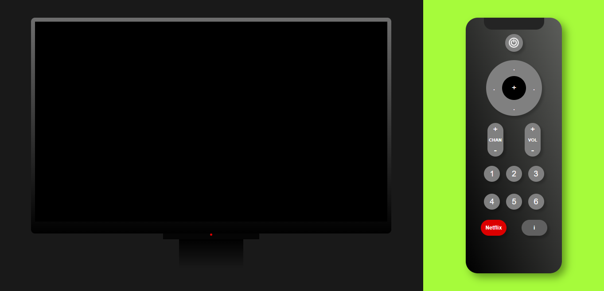
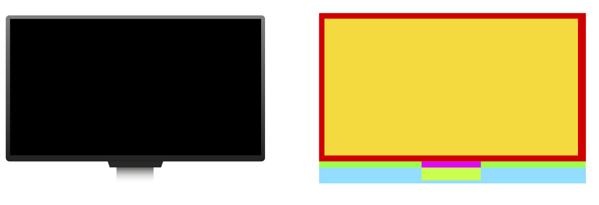
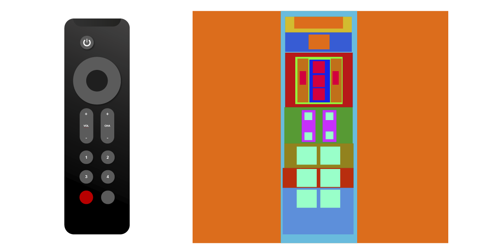

# Interactive TV :tv:

The interactive TV is the second project of the Full Stack Developer bootcamp at Geekshubs. In this project, the requirements included developing an interactive television capable of turning on and off, and depending on this state, being able to change channels, display a section with the date activated by pressing a button, and other optional features such as increasing and decreasing the volume.

## Table of Contents 🗂️

- [Stack 🛠️](#stack)
- [Features 🌟](#features)
- [Screenshots :camera:](#screenshots)
- [Preview :eyes:](#preview)
- [Roadmap :world_map:](#roadmap)
- [Author ✒️](#autor)
- [About me :hand:](#aboutme)

## Stack 🛠️

     

- **HTML5** - Page structure
- **CSS3** - Design and styles.
- **Javascript** - To make the TV interactive
- **Photoshop** - For some images, icons or gifs
- **Illustrator** - For layout and wireframe design

## Features 🌟

- #### ON/OFF
You can turn the TV on and off with the remote control. The other functions depend on this and are conditional upon it. Additionally, when the TV is on, an image is displayed on the screen. There is a LED indicator on the TV that lights up green to indicate that the device is on
- #### CHANGE CHANNELS: 
You can change channels once the device is turned on using the circular panel located in the upper-middle section of the remote control. Additionally, channels can be changed with the buttons located in the mid-right section or individually by using the assigned numeric buttons.
- #### CURRENTLY DATE
You can display the date whenever the user wishes by pressing the button marked with an "i" (information) located in the bottom right corner of the remote control. Additionally, the central button on the circular panel in the upper-middle section can also be used to display the date.
- #### VOLUMEN CONTROL
The volume can be adjusted using the designated buttons, which are located in the middle-right section of the remote control. If the volume is lowered sufficiently, an icon will appear on the screen indicating that the device is in mute mode.
- #### NETFLIX 
There is a button labeled "Netflix," referencing a button that allows access to current streaming platforms. At the moment, its function is basic, only displaying a screen with limited information. Additional features are expected to be added later.
- #### RESPONSIVE 
This project has been designed to be responsive, allowing it to display correctly on different screen sizes.
- #### OTHER FEATURES 
The device aims to provide users with a comfortable experience that closely resembles using a real television set. Among the elements designed for this purpose is a subtle layer of light that appears when the screen is turned on, simulating the natural glow of a screen turning on. Additionally, the Netflix button, commonly seen on modern devices, has been included to enhance the familiarity of the interface.

## Screenshots :camera:

#### FULL SCREEN MODE

#### WIREFRAME

## Roadmap :world_map:

- ### Responsive Design
Soon there will be corrections to the responsive system, which may present some flaws on small screens like those of mobile devices

- ### Volume Control System
Additional adjustments will be made to the volume control system, in order to control the actual volume of the elements being played at the moment."

## Deployment :eyes:

To deploy this project:

[Live Demo](https://github.com/AbrahamEsc1911)

## Author ✒️

- [@AbrahamEsc1911](https://github.com/AbrahamEsc1911)

## 🚀 About Me
My name is Abraham Escobar, I am a graphic designer and a full-stack developer in progress. I am passionate about learning, curious, and very interested in the impact of technology on human beings and how it can contribute to solving both simple and complex problems in our existence.

________________________________
